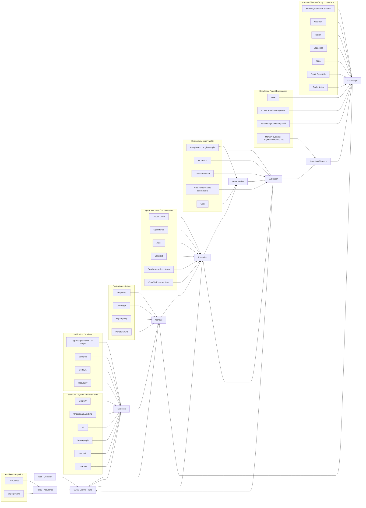
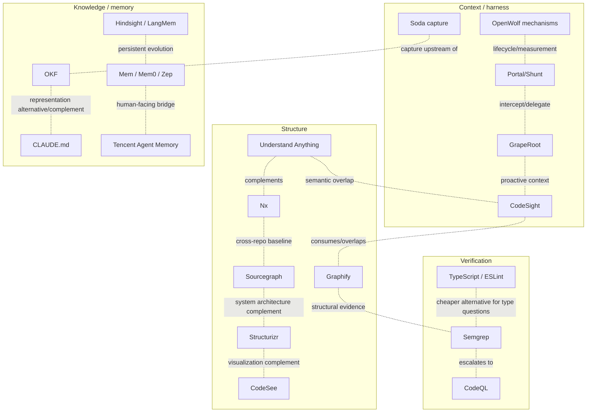

# EOKS tool landscape

This is the **current-state tool map** for EOKS. It is deliberately more visual and opinionated than the canonical capability model: its purpose is to let a researcher look across the ecosystem and decide which 2–3 tools are worth trying next.

It is a snapshot, not a benchmark. Ratings below represent what EOKS currently knows from research and inspection; they are **not measured EOKS scores** unless explicitly marked as such.

For the formal selection model, see [Tool capability model](tool-capability-model.md) and [Tool selection](tool-selection.md). For detailed source notes, see [`research/tool-notes.md`](../research/tool-notes.md).

## 1. One-glance EOKS map



### How to read the map

The arrows are **architectural fit**, not dependency claims. A tool can touch several areas. For example, a context engine can consume knowledge and structural evidence while remaining an execution-side integration rather than becoming EOKS itself.

The most important distinction is:

```text
EOKS layer       → what the layer needs
Tool             → one possible provider
EOKS             → decides which provider(s) to use
```

---

## 2. Current shortlist by EOKS layer

The table below is intentionally selective. It is the **experimentation shortlist**, not a list of every project mentioned in the research corpus.

Legend:

- **★** = particularly promising to experiment with now
- **○** = useful comparison / secondary candidate
- **△** = interesting prior art but not an immediate experiment
- **?** = insufficient evidence; research before relying on it

| EOKS area | ★ Most promising now | ○ Compare / complement | What we currently know | Main unknown to test |
|---|---|---|---|---|
| **Harness/context control** | **OpenWolf mechanisms**, **Portal/Shunt mechanisms** | native agent hooks | OpenWolf supplies lifecycle/state/measurement mechanisms; Shunt demonstrates hard interception and delegation of bulk reads/predictable generation. | Can EOKS intervene at the harness boundary without reducing task quality? |
| **Work capture** | **Soda-style passive capture** | Apple Notes, Mem, Tana | Soda represents ambient capture; the Medium evidence is explicitly private-beta and unvalidated. Apple Notes is the low-friction baseline. | Can work-derived capture beat manual capture while preserving privacy, provenance and acceptable noise? |
| **Context compilation** | **GrapeRoot**, **CodeSight** | Portal/Shunt | GrapeRoot is prior art for proactive repository context; CodeSight focuses on code understanding/context generation; Shunt attacks expensive I/O before it reaches the frontier model. | Which context operations should be compiled, delegated or retrieved natively? |
| **Knowledge representation** | **OKF** | `CLAUDE.md`, Tencent Wiki | OKF is a portable Markdown/YAML representation; `CLAUDE.md` is simple, human-reviewed local knowledge; Tencent's Wiki is a broader resource family. | Does a portable structured representation provide enough value to justify another format? |
| **Memory / learning** | **Hindsight / LangMem-style**, **Mem0/Zep-style** | Mem, Tana, Tencent Agent Memory | Strong prior art for persistent semantic/episodic/procedural memory; the key EOKS question is useful evolution rather than storage volume. | Does persistent learned memory improve future engineering work without accumulating stale/irrelevant knowledge? |
| **Repository/code structure** | **Graphify**, **Understand Anything** | CodeSee | Graph/relationship-oriented code understanding is useful for navigation and impact analysis. | When does a graph materially outperform search/retrieval or static analyzers? |
| **Cross-repository/project structure** | **Nx** | Sourcegraph | Nx's synthetic-monorepo/project-graph direction directly targets the repo divide; Sourcegraph is a strong cross-repository intelligence baseline. | Can project-level cross-repo structure be composed with semantic code and system representations? |
| **System architecture** | **Structurizr** | CodeSee | C4/system/landscape models provide a system-level layer that code graphs generally lack. | How should architecture models connect to actual code and runtime evidence? |
| **Visualization** | **Understand Anything**, **CodeSee** | Structurizr, Obsidian | Different tools expose code, dependency, architecture and human knowledge views. | Can humans navigate the same task-specific representation used by agents? |
| **Lightweight verification** | **Semgrep**, **TypeScript/ESLint/ts-morph** | modularity | Fast, deterministic evidence for patterns, types and targeted project rules. | Can these satisfy most questions before deeper analysis is necessary? |
| **Deep verification / dataflow** | **CodeQL** | Semgrep | Strong candidate for interprocedural/dataflow/security questions. | Is the additional setup/runtime justified by materially stronger evidence? |
| **Architecture assurance** | **TrueCourse**, **modularity** | Superpowers | Different approaches to architecture constraints/analysis; useful for testing preventive vs detective assurance. | Which architectural invariants can be enforced mechanically and where should they live? |
| **Workflow / execution** | **Claude Code**, **OpenHands** | Aider | Existing coding-agent runtimes provide realistic execution substrates for EOKS experiments. | Does EOKS coordination improve a strong single-agent baseline? |
| **Orchestration** | **Conductor-style systems**, **Langroid** | OpenHands-style workflows | Prior art for decomposition and multi-agent execution. | When does orchestration beat a single agent plus verification? |
| **Evaluation** | **Promptfoo**, **Aider/OpenHands benchmarks** | TransformerLab | Useful for repeatable task/model/configuration evaluation and end-to-end coding benchmarks. | Can evaluations attribute gains to context/tool/workflow changes rather than just detect them? |
| **Observability** | **LangSmith/Langfuse-style**, **Opik** | execution traces from agents | Strong infrastructure for traces, experiments and operational evidence; start with minimal local measurements. | Which trace signals actually predict useful EOKS interventions? |

### What I would actually play with

If the goal is to avoid benchmarking twenty tools, the current Phase A set is:

```text
HARNESS / CONTEXT
  OpenWolf mechanisms
  Portal/Shunt mechanisms

CAPTURE
  work-derived capture hypothesis (Soda as prior art)

REPRESENTATION
  Understand Anything
  Nx
  + Sourcegraph / Structurizr / CodeSee as comparison baselines

KNOWLEDGE / INSPECTION
  ordinary Markdown / CLAUDE.md / OKF
  Obsidian as inspection surface

VERIFICATION
  Semgrep
  CodeQL
  TypeScript/ESLint/ts-morph

ASSURANCE
  TrueCourse
  modularity

EXECUTION
  Claude Code
  OpenHands

EVALUATION
  Promptfoo
  local EOKS metrics first
```

This is **not** a claim that these are objectively the best products. They are the most useful *current experiments* because they cover distinct hypotheses with relatively little redundancy.

---

## 3. Tool families and their relative position

A second useful view is to compare tools by the **kind of evidence/resource they provide**, rather than by vendor/project.

```text
                         SEMANTIC / HUMAN INTERPRETATION
                                      ↑
                                      |
                     LLM / agent reasoning
                                      |
              CodeSight / Understand Anything
                                      |
              Graphify — structural relationships
                                      |
        Semgrep — patterns / targeted dataflow
                                      |
       CodeQL — deep interprocedural/dataflow
                                      |
 TypeScript / ESLint — types / local deterministic facts
                                      |
                                      ↓
                         MECHANICAL / DETERMINISTIC

     local/file  ←──────── scope ────────→ repository/system

     fast/cheap  ←──── operational cost ──→ slow/expensive
```

This is intentionally conceptual rather than numeric. A provider can move along several axes depending on configuration and question.

### The evidence ladder

For software-engineering questions, a useful **starting hypothesis** is:

```text
                 Is existing evidence sufficient?
                            |
                         no | yes → continue
                            ↓
             Type/compiler/language tooling
                            |
                         no |
                            ↓
                  lightweight rules
                    (Semgrep etc.)
                            |
                         no |
                            ↓
              structural / graph evidence
                            |
                         no |
                            ↓
             deep static/dataflow analysis
                         (CodeQL)
                            |
                         no |
                            ↓
                tests / runtime evidence
                            |
                         no |
                            ↓
                independent review / LLM
```

This is **not a universal ordering**. The Evidence Requirement determines the appropriate path. In some questions, runtime evidence should come first; in others, a graph is merely supporting evidence.

---

## 4. Relationship map: overlap vs complementarity

Rather than making a giant pairwise table, this graph identifies the relationships most useful for choosing experiments.



Relationship semantics come from the canonical capability model: **overlap, complement, alternative, escalation, specialization and dependency**. The graph should remain small and curated; a complete pairwise graph would become unreadable and stale.

---

## 5. What information do we actually have today?

The current evidence is uneven. This is important: the landscape should expose uncertainty rather than make every tool look equally understood.

| Information | Current state | Useful for choosing experiments? |
|---|---|---|
| Primary capability | **Good** for most tools | Yes |
| EOKS layer / architectural fit | **Good** | Yes |
| Strengths / weaknesses | **Moderate** | Yes, especially for shortlist |
| Overlap / complementarity | **Moderate** | Yes |
| Evidence kind | **Moderate/good** for analysis tools | Yes |
| Precision / recall | **Weak / mostly unmeasured by EOKS** | Not yet for hard ranking |
| Cost / latency | **Weak / environment-dependent** | Need local measurements |
| Setup / integration effort | **Moderate** | Yes |
| Provenance / explainability | **Moderate** | Yes |
| Real EOKS workload outcomes | **Very weak** | This is the main gap |
| Cross-tool causal comparison | **Very weak** | Major research opportunity |

For externally reported results, keep the evidence scope attached to the claim. For example, Spotify's 82–94% / ~90% result applies to its tested large-read scenarios; it should not become a generic EOKS assumption.

Therefore the landscape should currently answer:

> **What looks promising and why?**

not:

> **Which tool is objectively best?**

---

## 6. Recommended experimentation strategy

The efficient strategy is **one baseline + 2–3 providers per hypothesis**, not a benchmark of every product.

### Harness / context control

Compare:

```text
native agent context
       vs
OpenWolf-derived lifecycle/state mechanisms
       vs
Portal/Shunt-style interception/delegation
```

Hold the agent/model constant. Measure task outcome as well as tokens and latency.

### Work capture

Compare:

```text
manual / ordinary capture
       vs
low-friction baseline (Apple Notes-style)
       vs
work-derived capture hypothesis
```

The important outcome is useful future context, not the number of observations captured.

### Knowledge

Compare:

```text
CLAUDE.md / ordinary project docs
       vs
OKF bundle
```

Then ask whether the richer representation changes context selection or outcome quality.

### Structure / system representation

Compare progressively:

```text
repository search/native tooling
       vs
Understand Anything / Graphify
       vs
Nx cross-repo/project graph
       vs
Sourcegraph cross-repo baseline
       vs
Structurizr system model
```

Do not require every provider in every experiment. The goal is to discover the **minimum sufficient representation composition** for real engineering questions.

### Visualization / human inspection

Compare whether task-specific artifacts are understandable through:

```text
Obsidian / Markdown
       vs
code/dependency views (Understand Anything / CodeSee)
       vs
system architecture views (Structurizr)
```

### Verification

This is the clearest candidate for an evidence ladder experiment:

```text
TypeScript / ESLint
       → Semgrep
       → CodeQL
       → tests/runtime evidence
```

Measure whether escalation actually improves correctness enough to justify its cost.

### Execution / orchestration

Compare:

```text
strong single coding agent
       vs
agent + verification
       vs
orchestrated executor/reviewer
```

Don't assume more agents are better.

### Memory / evolution

Compare:

```text
no persistent memory
       vs
episodic/semantic memory
       vs
procedural/learned memory
```

The critical metric is not just retrieval quality; it is **future task outcome after memory has been allowed to influence behavior**, including whether stale or contradictory memory is detected and corrected.

---

## 7. Gaps that should drive research

The landscape reveals several gaps that the capability model alone cannot fill.

### A. We need a real tool registry

The information is currently Markdown. A future machine-readable registry should encode at least:

```yaml
tool:
category:
capabilities:
evidence_kinds:
scope:
depth:
strengths:
weaknesses:
best_fit:
poor_fit:
relationships:
operational:
evidence_status:
```

The Markdown landscape and comparison matrices could then be generated from it.

### B. We need confidence on the *tool facts themselves*

There is an important second-order problem: EOKS currently records claims about tools without always recording how those claims were established.

Eventually each important capability should have something like:

```text
claim
  ↓
source / version
  ↓
observation type
  ↓
confidence
  ↓
last verified
```

This prevents the tool-selection layer from treating old research notes as timeless facts.

### C. We need capability coverage, not just categories

“Static analysis” is too broad. The useful question is:

```text
Can this provider establish:
  local pattern?
  type property?
  dependency relationship?
  architectural rule?
  interprocedural flow?
  runtime behavior?
  semantic intent?
```

This is where the structured capability model should evolve through experiments.

### D. We need to test **minimum sufficient evidence**

This is arguably the most EOKS-specific experiment:

> Can we avoid expensive tools most of the time while retaining the correctness of a stronger evidence stack?

If yes, evidence-aware control may be a genuinely useful contribution of EOKS.

### E. We need causal experiments

If GrapeRoot, Graphify, CodeQL, Portal/Shunt or a memory provider appears to improve an agent, we need to distinguish:

```text
better context
better evidence
better workflow
better model
more tokens
more retries
```

from one another. Otherwise the landscape remains a collection of plausible tool descriptions rather than an empirical basis for control.

### F. We need an explicit representation/evolution boundary

A durable representation should not become a dumping ground for every observation. EOKS needs to distinguish:

```text
observation
   ↓
representation / evidence
   ↓
synthesis
   ↓
useful knowledge
   ↓
refresh / invalidate / evolve
```

This is where the evolving-context work connects to the tool landscape: the interesting question is not how much can be stored, but how much useful future work can be enabled.

---

## 8. Status of this map

**Current status: research snapshot.**

The stars are prioritization recommendations for experimentation, not benchmark results. They should change as EOKS tests tools on real workloads.

The intended evolution is:

```text
Today
  tool notes + capability profiles
          ↓
Next
  structured tool registry + landscape
          ↓
Then
  measured capability / operational facts
          ↓
Then
  workload-specific evidence outcomes
          ↓
Eventually
  EOKS selection policy learns which provider to use
```

The purpose of this document is to make the **current map of the territory** visible while the formal capability/selection model remains the source of truth for future automated selection.

---

## 9. Phase A overlay: current representation and capture landscape

This section is the current synthesis of the newer research. It does not replace the broader historical map above.

### Capture and knowledge tools

The second-brain tools occupy different points in the capture/organization/evolution space:

| Tool | What it contributes to EOKS research | Boundary |
|---|---|---|
| **Apple Notes** | Extremely low-friction manual capture baseline | Not a knowledge architecture; useful as a capture-friction benchmark |
| **Notion** | Structured workspace, databases, collaboration | High organization power does not remove capture burden |
| **Obsidian** | Local Markdown, links, graph visualization, human curation | Best treated as an inspection/curation surface, not agent runtime memory |
| **Capacities** | Typed/object-based knowledge representation | Useful representation comparison; still user-driven capture |
| **Tana** | Typed graph/supertag model plus increasingly automated capture/agent access | Strong bridge between structured representation and evolving memory; Phase B for EOKS persistence |
| **Roam Research** | Linked temporal/daily-note model | Useful temporal-knowledge comparison; still deliberate capture |
| **Mem** | AI-assisted capture/recall | Relevant persistent-memory prior art; trust, provenance and recall quality remain experimental |
| **Soda** | Ambient/work-derived capture hypothesis | Private-beta evidence; validate before relying on it |

### Software-system representation tools

```text
code / semantic
  Understand Anything
       │
       ▼
project / dependency / cross-repo
  Nx ───────── Sourcegraph
       │
       ▼
system / architecture
  Structurizr
       │
       ├── visualization: CodeSee / Understand Anything
       ├── evidence: Semgrep / CodeQL
       └── runtime: traces / telemetry
```

The experiment is not to choose one of these as the canonical graph. It is to determine the **minimum provider composition** that can answer real system-level questions and construct useful task-specific context.

### Harness mechanisms

OpenWolf and Spotify Portal/Shunt are complementary rather than interchangeable:

- OpenWolf contributes lifecycle/state/session/measurement mechanisms.
- Shunt contributes enforced interception and delegation of high-volume I/O/predictable generation.
- Both should remain replaceable EOKS mechanisms behind a small event/policy interface.

The Spotify result is useful as an empirical prior, but only within its tested scope: 82–94% savings on selected large-read scenarios, with known limits around editing, reasoning and latency.

### Current EOKS principle

> **EOKS is not a second brain. It is a work-coupled context/synthesis system.**

Knowledge, representation and memory are intermediate resources. Their value is determined by whether they improve future engineering work while remaining correct, attributable and appropriately scoped.
